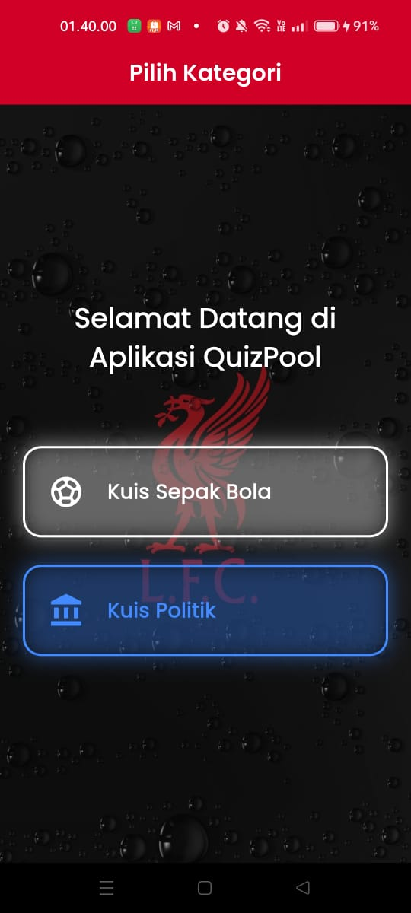
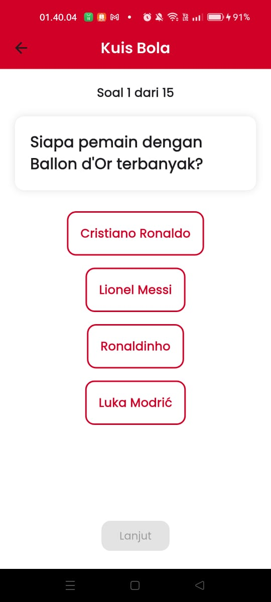
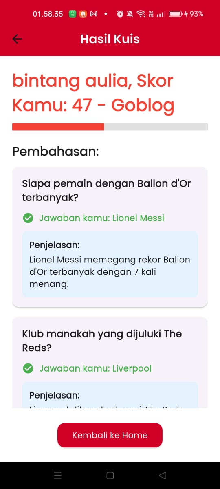

- Nama            : Bintang Aulia, 231401074, LAB 1
- Nama Aplikasi   : QuizPool
- Credit          : https://id.pinterest.com/


## **Screenshot**





# ⚽ QuizPool - Aplikasi Kuis Sepak Bola

QuizBola adalah aplikasi kuis interaktif tentang sepak bola, dibuat dengan Flutter. Aplikasi ini menampilkan pertanyaan pilihan ganda, menghitung skor pengguna, menampilkan pembahasan, dan memberikan feedback suara sesuai performa pemain.

---

## **Fitur Utama**

- Pilihan ganda interaktif untuk setiap pertanyaan
- Hitung skor otomatis dengan konversi persentase (1–100)
- Progress bar dengan warna dinamis:
    - **Merah** jika skor < 75
    - **Hijau** jika skor ≥ 75
- Feedback suara sesuai skor:
    - Skor tinggi (≥ 75) → suara “sukses”
    - Skor rendah (< 75) → suara “gagal”
- Menampilkan pembahasan lengkap untuk setiap pertanyaan
- Tampilan responsif dan mendukung rotasi layar
- Mode gelap dan terang (Dark / Light Theme toggle)
- Menggunakan font custom Google Fonts (bisa diganti global)

---


---

## **Struktur Folder**
```agsl
lib/
├─ main.dart
├─ pages/
│ ├─ home_page.dart
│ ├─ quiz_page.dart
│ └─ result_page.dart
├─ models/
│ └─ question.dart
├─ widgets/
│ ├─ answer_option.dart
│ ├─ question_card.dart
│ └─ result_card.dart
├─ services/
│ └─ audio_service.dart
├─ utils/
│ └─ score_calculator.dart
└─ theme/
└─ app_theme.dart

```

---

## **Getting Started**

### **Prerequisites**

- Flutter SDK ≥ 3.x
- Dart ≥ 3.x
- Android Studio / VSCode
- Emulator atau device fisik


### **Install dependencies**

```bash
flutter pub get

```

## **Run project**
```agsl
flutter run

```


Cara Menggunakan

Buka aplikasi → masuk ke halaman Home.

Pilih kuis sepak bola yang ingin diikuti.

Jawab pertanyaan pilihan ganda.

Tekan Lanjut untuk ke pertanyaan berikutnya.

Setelah selesai, hasil kuis ditampilkan di halaman Result.

Lihat skor, progress bar, dan pembahasan setiap pertanyaan.

Nikmati feedback suara sesuai performa.

Konfigurasi Tambahan
Ganti Font Global

Buka file: lib/theme/app_theme.dart

Ganti GoogleFonts sesuai font pilihan.

Audio Feedback

File audio: assets/sounds/siuuu.mp3 dan assets/sounds/soundketawa.mp3

Bisa diganti di: lib/services/audio_service.dart

Dark / Light Theme

Tersedia toggle theme di AppBar atau setting global di AppTheme.